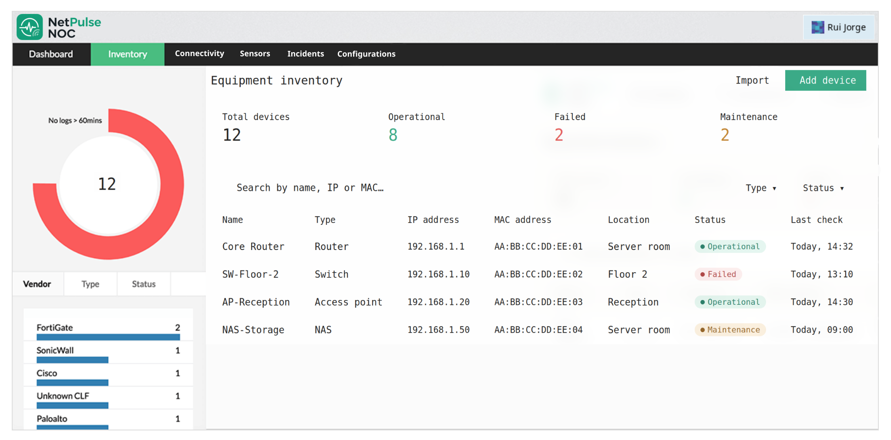

# Arquitetura

## Estruturas de Dados 

### Equipment Inventory (Doubly Linked List)

Utilizamos uma Doubly Linked List com dois apontadores (head e tail) e uma variável 'count' para contagem do número de equipamentos.

#### Funções (Algoritmos)

|            Função              | Eficiência |
| :----------------------------- | :--------: |
| insert_tail()                  | O(1)       |
| remove_by_id()                 | O(n)       |
| find_by_id()                   | O(log n)   |
| find_by_ip/mac()               | O(1)       |
| sort_by_status/type/location() | O(n log n) |

Na função `find_by_id()` utilizamos um array auxilar ordenado, de modo que seja possível utilizar o algoritmo de Binary Search, sempre que inserido/removido um novo equipamento é atualizado o array auxiliar.


### MAC/IP do Equipment (Hashmap)

Trabalho extra para valorização da nota final, implementamos então dois hashmaps (IP e MAC) com as colisões resolvidas por linked list. Obtendo assim uma eficiência de O(1) nas funções de `find_by_ip()` e `find_by_mac()`, hash function utilizamos o algoritmo DJB2.

#### Funções (Algoritmos)

|            Função              | Eficiência |
| :----------------------------- | :--------: |
| hashmap_insert()               | O(1)       |
| hashmap_lookup()               | O(1)       |
| hashmap_remove()               | O(1)       |


Os hashmaps funcionam como index auxiliares para pesquisa mais eficiênte por IP e MAC, embora seja raro com o algoritmo DJB2 haver colisões pode acontecer e no pior caso a eficiência é O(n).


### Incident (Queue)

Utilizamos uma Queue com dois apontadores (head e tail) e uma variável 'count' para contagem do número de incidentes.

#### Funções (Algoritmos)

|            Função              | Eficiência |
| :----------------------------- | :--------: |
| enqueue()                      | O(1)       |
| dequeue()                      | O(1)       |
| peek_head()                    | O(1)       |
| find_by_equip()                | O(n)       |
| filter_by_priority()           | O(n)       |


### Configurations (Stack)

Utilizamos uma Stack com um apontador (top) e uma variável 'count' para contagem do número de configurações.

#### Funções (Algoritmos)

|            Função              | Eficiência |
| :----------------------------- | :--------: |
| push()                         | O(1)       |
| pop()                          | O(1)       |
| peek()                         | O(1)       |
| peek_n()                       | O(n)       |
| filter_by_equip()              | O(n)       |


### Sensors  (Singly Linked List)

Utilizamos uma Singly Linked List com um apontador (head) e uma variável 'count' para contagem do número de leituras dos sensores. 

#### Funções (Algoritmos)

|            Função              | Eficiência |
| :----------------------------- | :--------: |
| insert_head()                  | O(1)       |
| find_by_code()                 | O(n)       |
| filter_anomalous()             | O(n)       |


## Algoritimos (Sorting, Binary e Linear Search)

### Sorting

Utilizamos o Merge Sort, mostrando maior eficiência em relação aos outros algoritmos de ordenação como Bubble Sort, Selection Sort e Insertion Sort. Utilizamos o algortimo de slow/fast pointer para encontrar o node do meio, divindo a linked list em duas linked lists.

|            Função              | Eficiência |
| :----------------------------- | :--------: |
| sort_by_status()               | O(n log n) |
| sort_by_type()                 | O(n log n) |
| sort_by_location()             | O(n log n) |


### Binary Search

Utilizamos Binary Search para encontrar o equipamento por id 'find_by_id()', utilizamos um array auxiliar e ordenado.

|            Função              | Eficiência |
| :----------------------------- | :--------: |
| find_by_id()                   | O(log n)   |


### Linear Search

Utilizamos Linear Search para o resto das operações de pesquisa, evitando assim excesso uso de memória.

|            Função              | Eficiência |
| :----------------------------- | :--------: |
| find_by_equip()                | O(n)       |
| filter_by_priority()           | O(n)       |
| filter_by_equip()              | O(n)       |
| find_by_code()                 | O(n)       |
| filter_anomalous()             | O(n)       |


## Layout

|     Ficheiro       |                          Descrição                            |
| :----------------- | :------------------------------------------------------------ |
| src/               | ficheiros .c, implementação da função.                        |
| inc/               | ficheiros .h, implementação do prototipo da função e structs. |
| ui/                | ficheiros .c e .h relacionados com ambiente gráfico.          |
| data/              | ficheiros .txt .dat, relacionados com os dados.               |
| assets/            | imagens para ambiente gráfico da aplicação                    |
| structs.h          | todos os tipos (struct e enum)                                |
| equipment.c        | doubly linked list + merge sort                               |
| hashmap.c          | MAC e IP                                                      |
| incident.c         | queue                                                         |  
| config.c           | stack                                                         |
| sensor.c           | singly linked list                                            |
| persistence.c      | ficheiros binarios e texto                                    |
| connectivity.c     | ping + parse do resultado                                     |
| reports.c          | gerar relatórios                                              |


## Convenções (Boas práticas)

O código deve ser consistênte e evitar misturar estilos para seguir as boas práticas, por isso utilizamos convenções padrão utilizadas na Linguagem C.

### Structs 

Utilizamos o sufixo `_t` e snake_case, como no exemplo:

```c 

typedef struct node_equip_t {
    equipment_t data;
    struct node_equip_t *next;
    struct node_equip_t *previous;
} node_equip_t;

```

### Enums

Utilizamos o sufixo `_t` e em SCREAMING_SNAKE_CASE, como no exemplo:

```c 

typedef enum {
    STATUS_OPERATIONAL,
    STATUS_FAILED,
    STATUS_MAINTENANCE,
    STATUS_DISABLED
} equip_status_t;

```

### Funções

Utilizamos o prefixo do módulo + estrutura de dados + operação e em snake_case, como no exemplo:

```c 

equip_list_insert()
equip_list_remove()
equip_list_find_by_ip()

incident_queue_enqueue()
incident_queue_dequeue()

```

### Variáveis

Utilizamos snake_case, como no exemplo:

```c 

char ip_address[16];
char mac_address[18];

```

### Macros

Utilizamos SCREAMING_SNAKE_CASE, como no exemplo:

```c 

#define STRING_MAX     100
#define IP_MAX          16
#define MAC_MAX         18
#define PASSWORD_MAX   256

```


## Interface Gráfica

A implementação da interface gráfica (GUI) é feita com recurso ao GTK4 com personalização realizada em CSS (style.css), a interface foi inspirada em aplicações com o mesmo foco como o OpManager da ManageEngine e o N-central da TechRadar.



No exemplo do design da interface, podemos verificar a posição do logotipo no canto superior esquerdo, o atual utilizador em sessão no canto superior direito, logo de seguinda em baixo vemos o menu/topbar com as opções de acesso aos módulos. 

O menu/topbar é utilizado o widget `GtkBox` com o modo `GTK_ORIENTATION_HORIZONTAL`, sendo inserido os botões que representam os módulos.

É utilizado o widget `GtkStack` para controlar o acesso a esses módulos cada um inserido numa `GtkStackPage`. 

Para as listas de equipamentos e incidentes é utilizado uma forma manual de exibição, consistindo em dois loops `for`. O primeiro loop representa as linhas da lista (número total de equipamentos) e o segundo loop representa as colunas da lista (elementos de cada equipamento.), cada interação é inserido num `GtkGrid`.


### Cores

Cores utilizadas no design da aplicação:

* #19c37d (Verde, cor principal)
* #171717 (Preto, utilizado no topbar e como cor secundária)
* #f5f6f8 (Branco, utilizado como background)
* #ff4d4f (Vermelho, utilizado como estado 'Critical')
* #faad14 (Amarelo, utilizado como estado 'Warning')
* #52c41a (Verde, utilizado como estado 'Operational')
